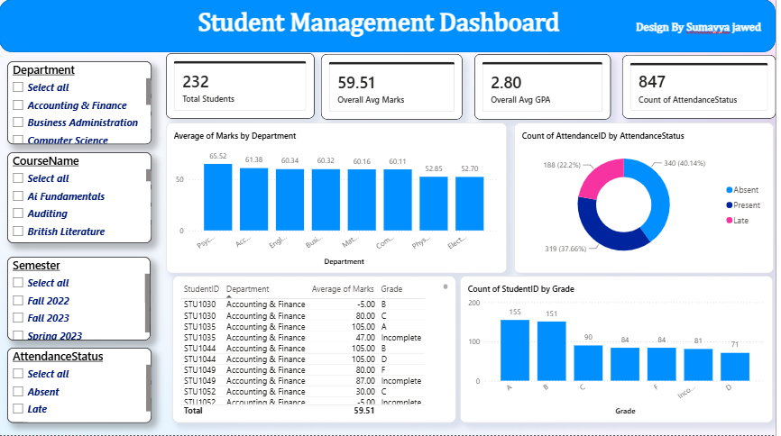

# 🎓 Student Management System - Power BI Dashboard

An interactive Power BI dashboard designed to analyze student enrollments, academic performance, attendance, and course distributions.

---

## 🖼️ Dashboard Preview

## 🖼️ Model Preview

---

## 📁 Repository Structure
* `Student_Management_Dashboard.pbix` - Power BI Interactive File
* `Student_Management_Dashboard_Final.pdf` - PDF Report Export
* `Students.xlsx`, `Attendance.xlsx`, `Courses.xlsx`, `Enrollments_Marks.xlsx` - Datasets

---

## 🛠️ Tools & Skills
* **Power BI Desktop** (Data Modeling, DAX, Power Query, Data Visualization)
* **Microsoft Excel** (Data Sources)
